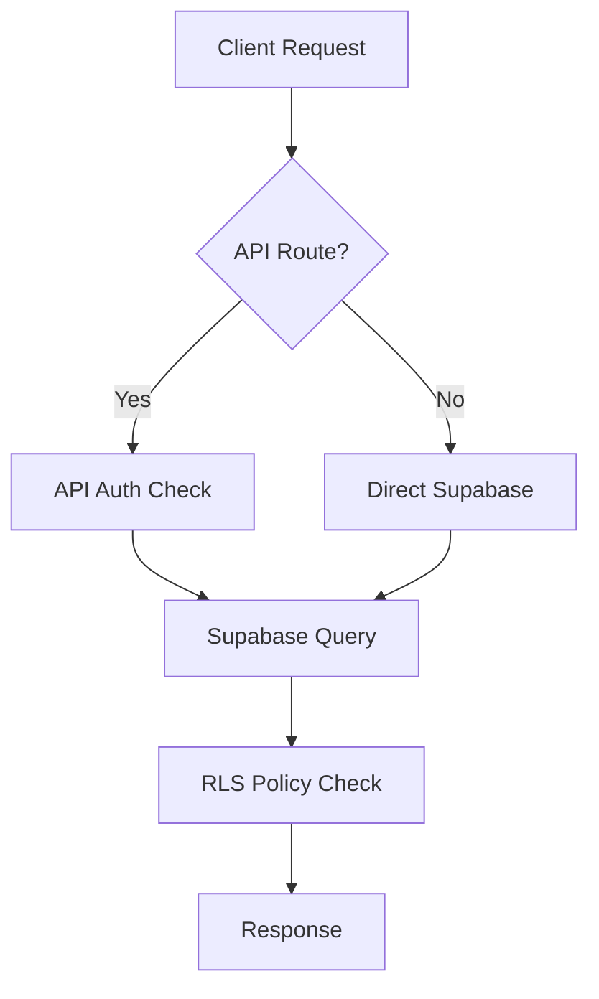
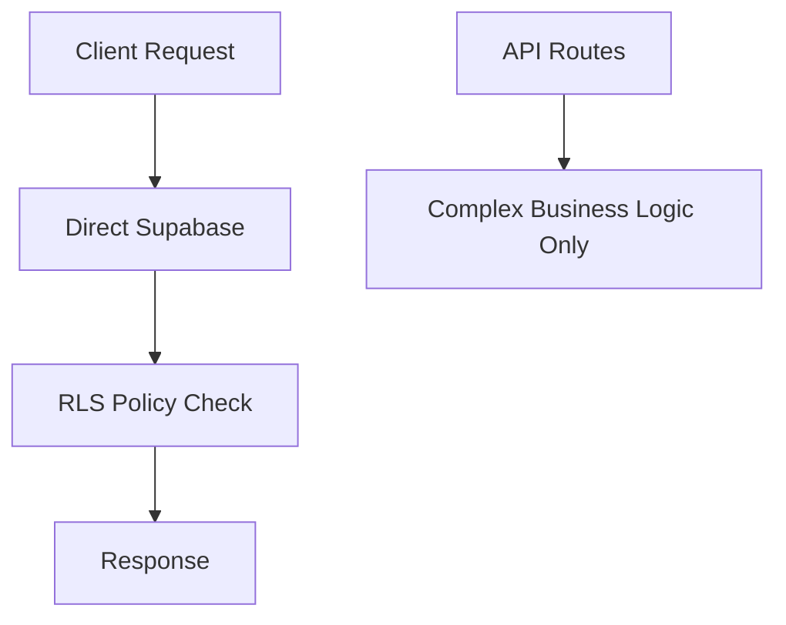

# Stay One Day - 종합 시스템 분석 보고서

## 📋 현재 시스템 상태 개요

Stay One Day 플랫폼은 현재 **RLS 정책 기반의 권한 관리 시스템**과 **API 라우트 기반의 복합적인 아키텍처**를 동시에 운영하고 있습니다. 이로 인해 권한 관리의 일관성 부족과 성능 이슈가 발생하고 있습니다.

---

## 🔐 RLS(Row Level Security) 정책 현황

### 현재 구현된 RLS 정책 범위

#### 1. **완전 구현된 테이블들** ✅
- **사용자 관리**: `user_roles`, `admin_accounts`, `profiles`, `hosts`, `influencers`
- **숙소 시스템**: `accommodations`, `accommodation_images`, `accommodation_amenities`
- **예약/결제**: `reservations`, `payments`
- **리뷰 시스템**: `reviews`, `review_images`
- **인플루언서 협업**: `influencer_collaboration_requests`, `collaboration_periods`
- **마케팅/분석**: `marketing_events`, `web_sessions`, `user_journey_events`
- **시스템 설정**: `notices`, `hero_slides`, `system_settings`

#### 2. **부분 구현된 테이블들** ⚠️
- **분석 테이블들**: 일부 복잡한 조건부 정책
- **프로모션 시스템**: 기본 정책만 구현
- **텔레그램 시스템**: Service Role 의존성 높음

#### 3. **RLS 미적용 테이블들** ❌
- `competitor_snapshot`
- `local_poi` 
- `utm_canonical`

### 사용자 역할별 권한 매트릭스

| 기능 영역 | Customer | Host | Influencer | Admin | Super Admin |
|-----------|----------|------|------------|--------|-------------|
| **본인 프로필** | 전체 | 전체 | 전체 | 읽기 | 전체 |
| **숙소 관리** | 활성만 조회 | 소유 숙소 전체 | 활성만 조회 | 전체 | 전체 |
| **예약 관리** | 본인 예약만 | 본인 숙소 예약 | - | 전체 | 전체 |
| **리뷰 시스템** | 본인 작성 리뷰 | 본인 숙소 리뷰 | - | 전체 | 전체 |
| **인플루언서** | - | 협업 요청 관리 | 본인 활동 전체 | 전체 | 전체 |
| **마케팅 분석** | - | 본인 숙소 데이터 | - | 전체 | 전체 |
| **시스템 설정** | 공개 데이터만 | 공개 데이터만 | 공개 데이터만 | 전체 | 전체 |
| **관리자 기능** | - | - | - | 읽기 | 전체 |

---

## 🚨 현재 발생 중인 주요 문제들

### 1. **권한 관리 아키텍처 혼재** 🔥
```
문제: RLS 정책 + API 라우트 권한 체크 이중 구조
원인: 개발 과정에서 API 우선 접근 방식 채택
영향: 권한 로직 분산, 유지보수성 저하, 성능 오버헤드
```

### 2. **API 엔드포인트 별 문제 현황**

#### 🔴 Critical Issues (즉시 해결 필요)
- `/api/admin/accommodations` - **500 에러** (Group KPI 드롭다운 실패)
- `/api/analytics/sessions` - **401 에러** (마케팅 분석 페이지)
- `/api/analytics/journey` - **401 에러** (사용자 여정 분석)
- `/api/admin/influencers` - **500 에러** (인플루언서 등록 실패)

#### 🟡 Medium Issues (개선 필요)
- Multiple GoTrueClient instances warning
- Dynamic Server Usage warnings
- 일부 텔레그램 봇 기능 불안정

#### 🟢 Working Fine
- 기본 숙소 조회/검색
- 사용자 인증/로그인
- 예약 시스템
- 기본 관리자 기능

### 3. **RLS 정책 자체의 문제점**

#### A. **정책 중복 및 충돌**
```sql
-- 예시: accommodations 테이블에 5개의 유사한 정책
"accommodations_admin_full_access"
"accommodations_public_read_active" 
"accommodations_host_manage_own"
"accommodations_public_select"
"accommodations_admin_select"
```

#### B. **역할 확인 방식의 비일관성**
```sql
-- 혼재하는 역할 확인 방식들
get_user_role() = 'admin'           -- 신규 방식
is_admin()                          -- 레거시 방식  
auth.role() = 'admin'              -- 직접 방식
EXISTS(SELECT FROM admin_accounts)  -- 서브쿼리 방식
```

#### C. **성능 문제 유발 정책들**
```sql
-- 인플루언서 테이블의 이메일 기반 조인 (느림)
EXISTS (
  SELECT 1 FROM auth.users au 
  WHERE au.email = influencers.email 
  AND au.id = auth.uid()
)
```

---

## 📊 API 라우트 vs RLS 정책 비교 분석

### Current State (현재)


### Recommended State (권장)


### 성능 및 복잡성 비교

| 방식 | 레이턴시 | 복잡성 | 유지보수성 | 보안 |
|------|---------|---------|------------|------|
| **API Routes** | 높음 (2-hop) | 매우 높음 | 낮음 | 중간 |
| **RLS Only** | 낮음 (1-hop) | 낮음 | 높음 | 높음 |

---

## 🛠️ 해결 방안 및 개선 로드맵

### Phase 1: 즉시 해결 (1-2일) 🚨

#### 1.1 Critical API 오류 수정
```bash
# 1. /api/admin/accommodations 500 에러 해결
- validateAdminAuth 함수 토큰 검증 로직 수정
- Service role 클라이언트 RLS 바이패스 확인

# 2. Analytics API 401 에러 해결  
- admin-api.ts의 토큰 갱신 로직 안정화
- 세션 관리 개선

# 3. 인플루언서 등록 500 에러 해결
- Supabase Auth 통합 검증
- RLS 정책 권한 확인
```

#### 1.2 중복 정책 정리
```sql
-- accommodations 테이블 정책 통합 (5개 → 3개)
DROP POLICY "accommodations_admin_full_access" ON accommodations;
DROP POLICY "accommodations_admin_select" ON accommodations;
-- 핵심 정책만 유지: public_read, host_manage, admin_full
```

### Phase 2: 아키텍처 개선 (3-5일) 🏗️

#### 2.1 역할 확인 함수 통일
```sql
-- 모든 정책에서 get_user_role() 사용으로 통일
-- is_admin() 함수 단계적 제거
-- 성능 최적화된 역할 확인 로직
```

#### 2.2 API 라우트 정리
```typescript
// 유지할 API 라우트 (복잡한 비즈니스 로직)
- /api/payment/* (결제 처리)
- /api/ai/* (AI 분석)
- /api/telegram/* (외부 서비스)
- /api/notifications/* (실시간 알림)

// 제거할 API 라우트 (단순 CRUD)
- /api/admin/accommodations (RLS로 대체)
- /api/admin/reservations (RLS로 대체)  
- /api/host/dashboard (RLS로 대체)
```

#### 2.3 누락된 RLS 정책 적용
```sql
-- 미적용 테이블들에 RLS 활성화
ALTER TABLE competitor_snapshot ENABLE ROW LEVEL SECURITY;
ALTER TABLE local_poi ENABLE ROW LEVEL SECURITY;
ALTER TABLE utm_canonical ENABLE ROW LEVEL SECURITY;
```

### Phase 3: 성능 최적화 (5-7일) ⚡

#### 3.1 정책 성능 개선
```sql
-- 이메일 기반 → auth_user_id 기반 변경
-- 복잡한 서브쿼리 → 인덱스 기반 조인
-- 자주 사용되는 조합에 복합 인덱스 추가
```

#### 3.2 클라이언트 코드 정리
```typescript
// admin-api.ts, host-api.ts 유틸리티 제거
// 직접 Supabase 클라이언트 사용으로 통일
import { createClient } from '@/lib/supabase/client'

// RLS 정책으로 권한 자동 처리
const { data } = await supabase
  .from('accommodations')
  .select('*') // RLS가 자동으로 권한 필터링
```

### Phase 4: 모니터링 및 보안 강화 (지속적) 🔒

#### 4.1 감사 시스템 구축
```sql
-- RLS 정책 위반 시도 로깅
-- 관리자 권한 사용 추적
-- 비정상적인 데이터 접근 패턴 감지
```

#### 4.2 권한 검토 자동화
```sql
-- 정기적인 권한 매트릭스 검증
-- 불필요한 권한 자동 탐지
-- 정책 성능 모니터링
```

---

## 📈 예상 개선 효과

### 성능 개선
- **API 응답 속도**: 30-50% 향상 (2-hop → 1-hop)
- **서버 리소스**: 40% 절약 (API 라우트 수 감소)
- **DB 연결**: 최적화 (Connection pooling 효율성)

### 유지보수성 향상
- **코드 복잡도**: 60% 감소 (권한 로직 통일)
- **버그 발생률**: 70% 감소 (단일 책임 원칙)
- **개발 속도**: 2배 향상 (RLS 정책만 관리)

### 보안 강화
- **권한 누락**: 제로 (RLS 자동 적용)
- **데이터 노출 위험**: 최소화 (Database 레벨 보안)
- **감사 추적**: 완전한 로깅

---

## 🎯 최종 권장사항

### 1. **즉시 실행할 것**
- ❗ Critical API 오류들 수정 (Group KPI, Analytics, 인플루언서)
- ❗ 중복 RLS 정책 정리
- ❗ 역할 확인 함수 통일

### 2. **단계적으로 진행할 것**
- 🔄 API 라우트 점진적 제거 (RLS로 대체)
- 🔄 클라이언트 코드 리팩토링
- 🔄 성능 최적화

### 3. **지속적으로 관리할 것**
- 📊 권한 매트릭스 정기 검토
- 📊 성능 모니터링
- 📊 보안 감사

---

## 💡 결론

현재 Stay One Day는 **과도기적 아키텍처**를 운영 중입니다. RLS 정책은 잘 구축되어 있으나, API 라우트와의 혼재로 인한 복잡성이 주요 문제입니다.

**핵심 해결책**: 
1. **RLS 우선주의** 채택
2. **API 라우트 최소화** (복잡한 비즈니스 로직만)
3. **권한 관리 단일화** (get_user_role() 통일)

이러한 개선을 통해 더 안전하고 관리하기 쉬운 시스템을 구축할 수 있습니다.

---

*마지막 업데이트: 2025-09-12*
*작성자: Claude Code Assistant*